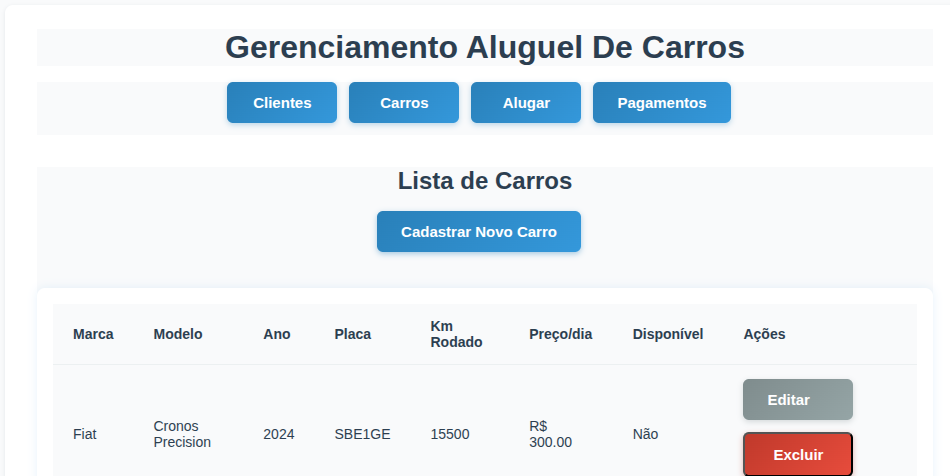

# Sistema de Aluguel de Carros React + TypeScript + Vite + NodeJs (API) + Sqlite (Banco De Dados) + Docker

Bem-vindo ao [TD3] DSW 2025.1!
Nesse trabalho foi utilizado a base do TD2, com as seguintes mudanças.
- Adicionado BackEnd com NodeJs e Express para realização das Api
- Substituição do LocalStorage por SQlite3, para banco de dados
- Adicionado Docker, arquivo dockerfile e docker compose (yaml)

## 🚗 Funcionalidades
- Cadastro De Clientes
- Editar Clientes
- Remover Clientes
- Cadastro de carros
- Editar Carros
- Remover Carros
- Efetuar Aluguel De Um Carro
- Editar Aluguel Do Veiculo
- Controle De Pagamentos Pagos/Pendentes

## A Spa roda via docker na porta 5000
http://localhost:5000/

## 🖼️ Telas Do Sistema

